# Lactare

Aplicativo Android nativo que conecta nutrizes doadoras a Bancos de Leite
Humano (BLHs).

---

## 1. Identificação

| |                 |
|---|-----------------|
| **Projeto** | Lactare         |
| **Equipe** | `Lactare Hub`   |
| **Repositório** | [Repositório](https://github.com/SouzaRaphael/Sprint3-Kotlin) |

### Integrantes

| Nome completo | RM |
|---|---|
| `David dos Santos Lima` | `555441` |
| `Enzo Francisco Luchini` | `557710` |
| `Matheus Amaral de Camargo Cardoso Lima` | `557686` |
| `Raphael Costa Souza` | `559024` |

---

## 2. Objetivo do aplicativo

Bebês prematuros dependem de leite humano para sobreviver às primeiras semanas,
e os bancos de leite brasileiros operam sempre abaixo da demanda. O gargalo
raramente é a falta de doadoras — é a distância entre quem quer doar e quem
sabe como.

O **Lactare** encurta essa distância. O aplicativo permite que uma nutriz:

- entenda em minutos se pode doar e como funciona o processo;
- se cadastre pelo celular e passe pela triagem sem sair de casa;
- encontre o BLH ou posto de coleta mais próximo;
- agende a coleta domiciliar na data e janela de horário que couberem na rotina;
- **acompanhe o rastreio de cada doação**, do frasco recolhido em casa até a
  UTI neonatal que recebeu o leite;
- aprenda com conteúdo produzido pela rede e compartilhe sua história.

Nesta Sprint todos os dados são **mockados**: não há API, Firebase nem banco
local, conforme a especificação.

---

## 3. Como executar

1. Abrir a pasta do projeto no **Android Studio**.
2. Aguardar o *Gradle Sync* concluir.
3. Selecionar um emulador ou dispositivo físico com **Android 7.0 (API 24)** ou
   superior.
4. Executar **Run 'app'** (`Shift + F10`).

Pela linha de comando, na raiz do projeto:

```bash
./gradlew installDebug
```

### Ambiente utilizado

| | |
|---|---|
| Android Studio | 2025.3.2 (build `AI-253.30387.90.2532.14935130`) |
| Android Gradle Plugin | 9.1.1 |
| Gradle | 9.3.1 |
| Kotlin | 2.2.10 |
| JDK | 17+ (o projeto compila com `sourceCompatibility` 11) |
| `compileSdk` | 37 (precisa estar instalada no SDK Manager) |
| `minSdk` / `targetSdk` | 24 / 36 |

### Credenciais de teste

O login é mockado e aceita a conta abaixo. **Tocar na linha das credenciais na
tela de login preenche o formulário automaticamente.**

| Perfil | E-mail | Senha |
|---|---|---|
| Doadora | `giovana@email.com` | `doadora123` |

Senha incorreta devolve mensagem de erro; senha correta abre a área da doadora.
Também é possível concluir o **cadastro** e entrar com a jornada zerada.

---

## 4. Telas implementadas

Todos os prints abaixo são do aplicativo Android rodando no emulador
(Medium Phone, API 36.1).

### 4.1 Splash

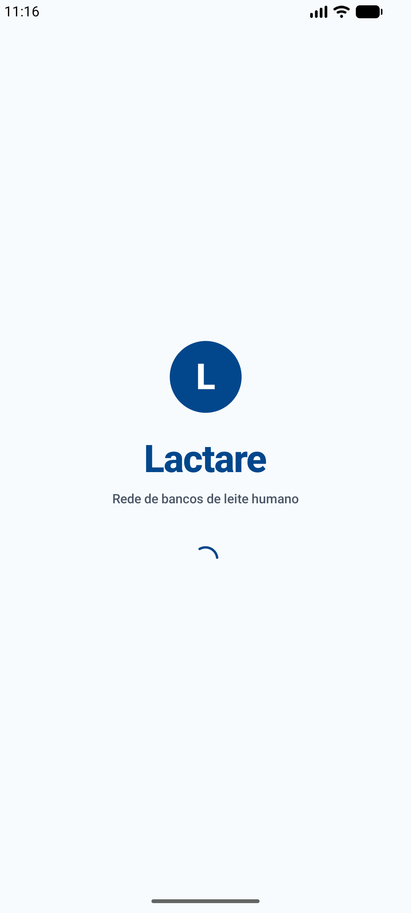

Abertura da marca. Após dois segundos leva à home pública.

### 4.2 Landing — home pública

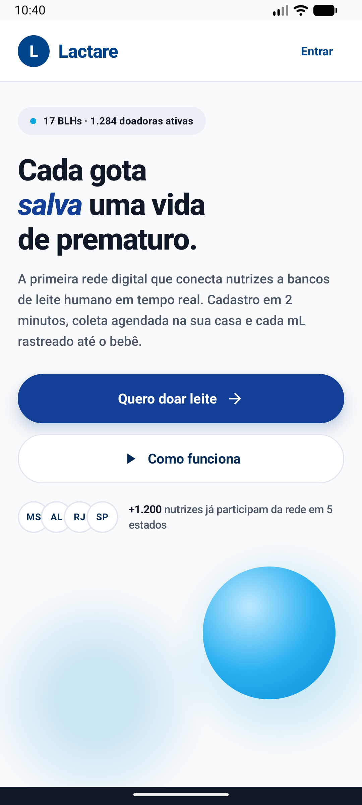

Apresentação do produto: chamada principal, números da rede em faixa escura
(847 litros coletados, 8.470 bebês atendidos, 1.284 nutrizes, 17 BLHs), a seção
"Em 3 passos", convite às histórias e rodapé institucional. "Como funciona" rola
a página até os três passos.

### 4.3 Login

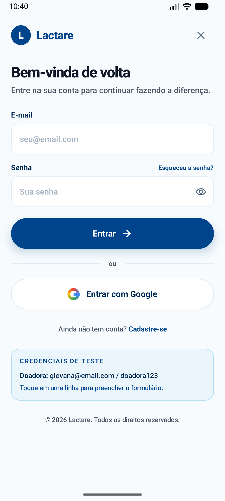

Autenticação com validação de campos, alternância de visibilidade da senha e
estado de carregamento no botão. A caixa **Credenciais de teste** traz a conta
aceita — tocar nela preenche o formulário.

### 4.4 Cadastro — 4 etapas

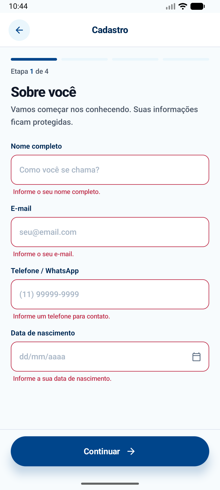 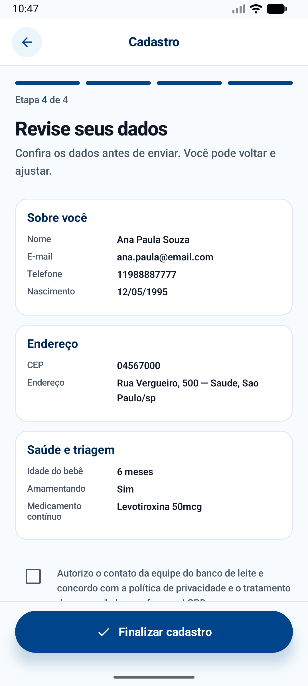

Formulário em quatro etapas com barra de progresso segmentada: *Sobre você* →
*Onde você está* → *Saúde e triagem* → *Revise seus dados*. Cada etapa valida os
próprios campos antes de avançar (à esquerda, as mensagens de erro da etapa 1),
o botão "Voltar" recua uma etapa e a última tela resume tudo o que foi
preenchido antes do aceite dos termos (à direita).

### 4.5 Cadastro concluído

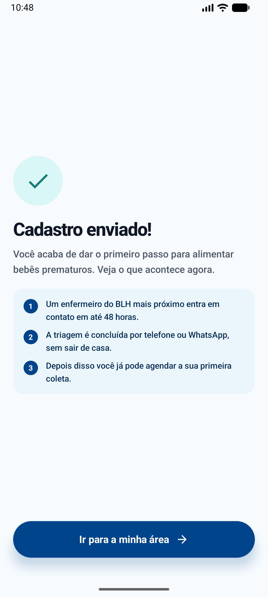

Confirmação com os próximos passos do processo de triagem.

### 4.6 Home da doadora — aba Início

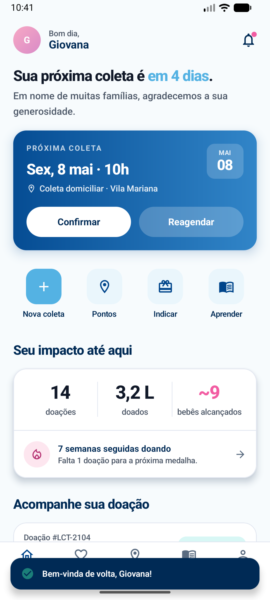 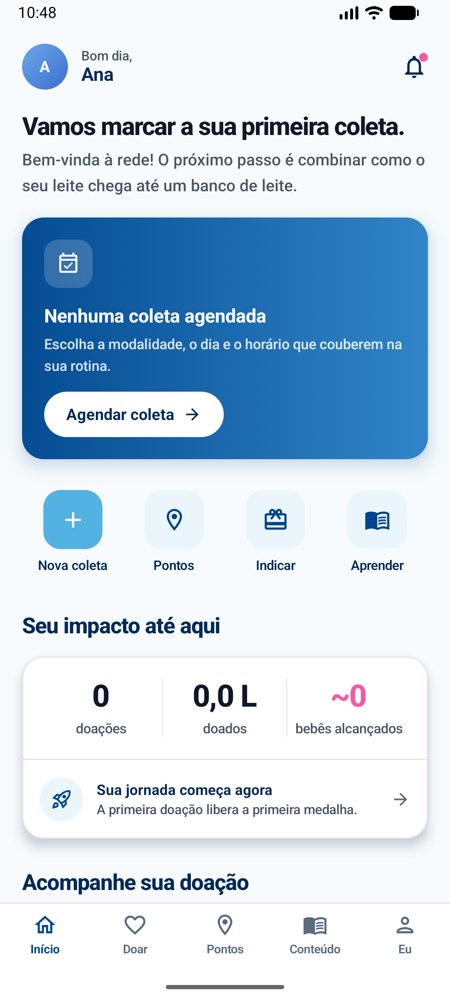

Saudação personalizada, card em gradiente com a **próxima coleta** e as ações
*Confirmar* / *Reagendar*, quatro atalhos rápidos, resumo de impacto pessoal
(14 doações · 3,2 L · ~9 bebês alcançados), prévia do rastreamento, mensagem da
equipe e carrossel de leituras.

À direita, a mesma tela para quem **acabou de se cadastrar**: sem coleta
agendada e sem doação a rastrear, os cards viram estados vazios que explicam o
que fará o conteúdo aparecer.

### 4.7 Agendar coleta — aba Doar

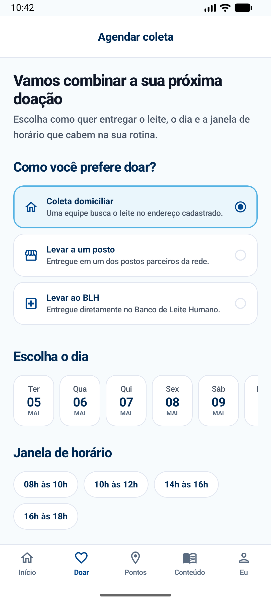

Escolha da modalidade (coleta domiciliar, posto ou BLH), fita de datas dos
próximos catorze dias, janelas de horário e observações. O botão só habilita
quando dia e horário estão selecionados — e, nas modalidades presenciais, também
o ponto de entrega.

### 4.8 Pontos de coleta — aba Pontos

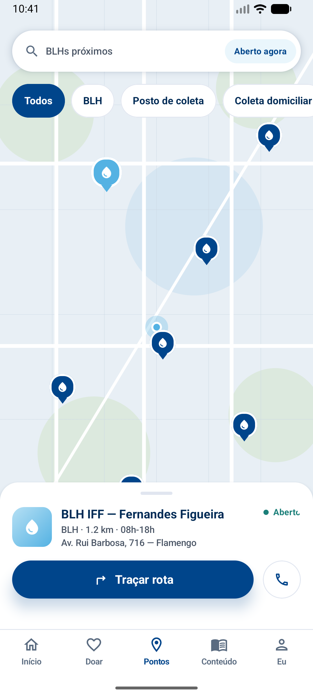 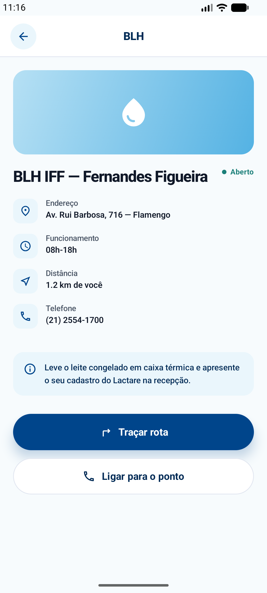

Mapa ilustrado com os pontos da rede, busca por nome/bairro, filtro por tipo e
alternador "Aberto agora". Tocar em um marcador abre a folha inferior com o
resumo; tocar nela abre o **detalhe do ponto** (à direita) com endereço,
funcionamento, distância e telefone.

### 4.9 Conteúdo — aba Conteúdo

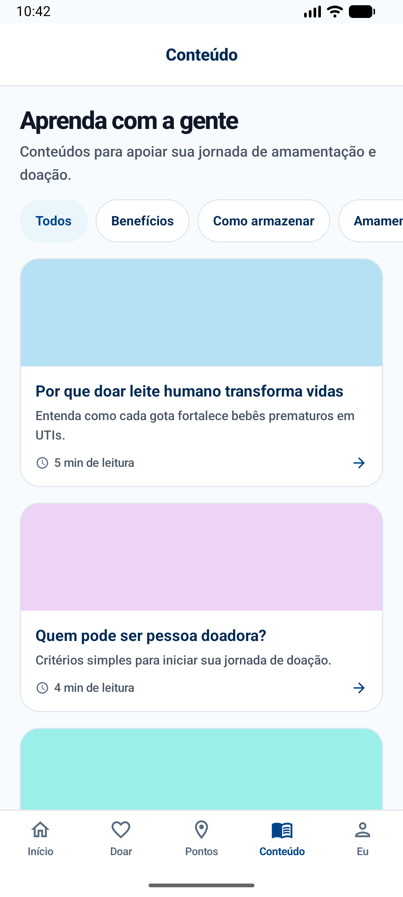 

Biblioteca de conteúdo educativo com filtro por categoria. Tocar em um card
abre o **artigo completo** (à direita), com tempo de leitura, autoria, corpo do
texto e ação de salvar na lista de leitura.

### 4.10 Rastreio da doação

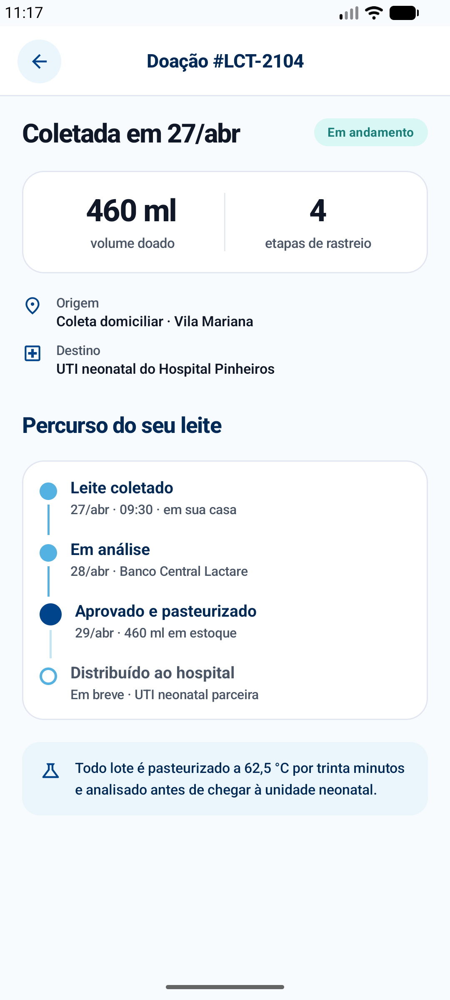

Percurso completo de uma doação: volume, origem, destino e a linha do tempo das
quatro etapas — do frasco recolhido em casa até a distribuição ao hospital.

### 4.11 Minha área — aba Eu

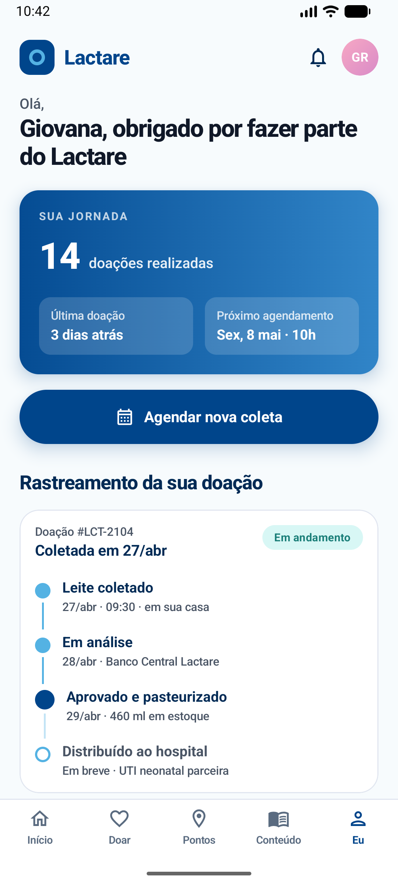 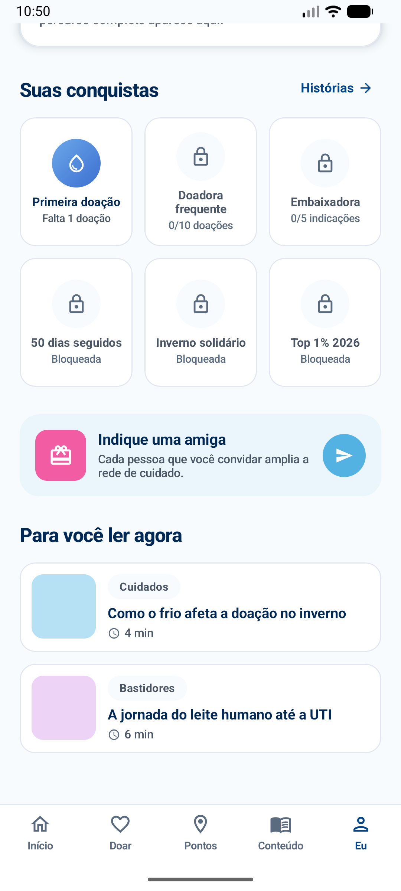

Card azul da jornada (doações realizadas, última doação, próximo agendamento),
atalho para agendar, rastreamento resumido da doação em trânsito, grade de
conquistas, convite para indicar uma amiga e lista de leituras.

### 4.12 Perfil

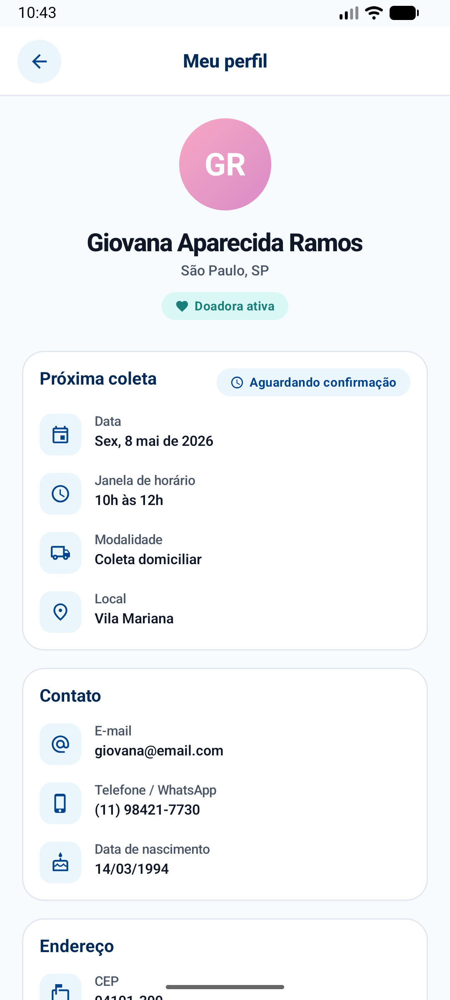

Dados do cadastro organizados em cards (contato, endereço, triagem), a coleta
agendada no momento, o resumo da jornada e a saída da conta.

### 4.13 Depoimentos

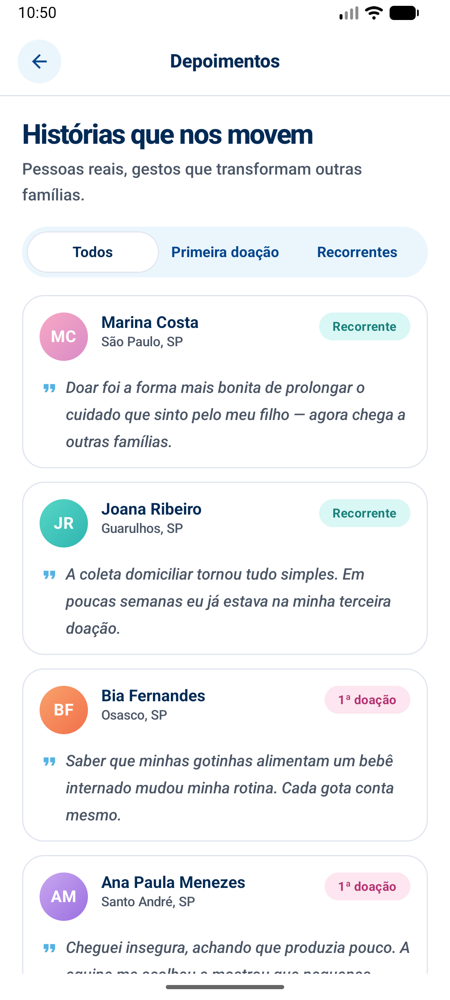 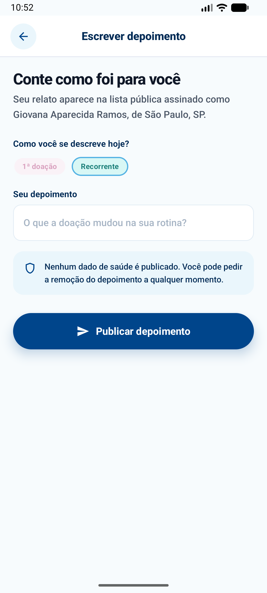

Histórias das doadoras com filtro segmentado (Todos / Primeira doação /
Recorrentes). Ao fim da lista, o convite para publicar a própria história abre o
formulário (à direita); o depoimento publicado entra no topo da lista.

---

## 5. Funcionalidades implementadas

### Requisitos funcionais desta Sprint

| # | Requisito funcional | O que foi implementado |
|---|---|---|
| RF01 | Apresentar a proposta para quem ainda não é doadora | Landing pública com números da rede, "Em 3 passos" e chamadas para cadastro |
| RF02 | Autenticar a doadora | Login mockado com validação de campos, erro de credencial e estado de carregamento |
| RF03 | Cadastrar nova doadora com triagem | Formulário em 4 etapas, validação por etapa, campo condicional de medicamentos e aceite de termos |
| RF04 | Agendar coleta | Escolha de modalidade, data, janela de horário, ponto de entrega e observações |
| RF05 | Confirmar ou reagendar a coleta | Ações no card da home, com retorno visual e reflexo imediato nas demais telas |
| RF06 | Localizar pontos de coleta | Mapa com marcadores, busca, filtro por tipo, "Aberto agora" e tela de detalhe |
| RF07 | Rastrear a doação | Linha do tempo das quatro etapas, da coleta à entrega no hospital |
| RF08 | Consultar conteúdo educativo | Lista filtrável por categoria e leitura completa do artigo |
| RF09 | Acompanhar impacto e conquistas | Estatísticas pessoais, jornada e grade de medalhas |
| RF10 | Ler e publicar depoimentos | Lista com filtro segmentado e formulário de publicação |
| RF11 | Consultar e encerrar a sessão | Tela de perfil com dados do cadastro e saída da conta |

### Justificativa da priorização

O pitch identificou como problema central a **distância entre quem quer doar e
quem sabe como doar**. A priorização seguiu o caminho que uma nutriz percorre
para resolver exatamente esse problema:

1. **Entender e se cadastrar** (RF01–RF03) — é o ponto de entrada; sem ele
   nenhum outro fluxo existe.
2. **Fazer a doação acontecer** (RF04–RF06) — agendar e localizar são o núcleo
   do produto, o momento em que a intenção vira ação.
3. **Sustentar a recorrência** (RF07, RF09, RF10) — o rastreio e o impacto
   pessoal foram priorizados porque respondem à pergunta que faz a doadora
   voltar: "o meu leite chegou a algum bebê?".
4. **Apoiar com informação** (RF08, RF11) — conteúdo e perfil completam a
   experiência, mas dependem dos anteriores para fazer sentido.

Ficaram fora desta Sprint os fluxos do lado institucional (painel do banco de
leite, gestão de estoque e rotas de coleta), por dependerem de backend real e
não pertencerem à jornada da doadora, que é o público-alvo do MVP.

---

## 6. Dados mockados

Todos os dados vivem em classes dedicadas no pacote `data/datasource`, nunca
espalhados nas telas. São dados realistas, coerentes com o contexto de bancos de
leite humano.

| Arquivo | Conteúdo |
|---|---|
| `ArticleMockDatasource` | 8 artigos educativos completos, com categoria, tempo de leitura, autoria e corpo em parágrafos |
| `AuthMockDatasource` | Conta aceita no login e as dicas exibidas na caixa de credenciais |
| `CollectionPointMockDatasource` | 7 pontos da rede — BLHs e postos reais da Rede Brasileira de Bancos de Leite Humano, com endereço, telefone, horário e posição no mapa |
| `DonationMockDatasource` | 3 doações com código de rastreio, volume, origem, destino e linha do tempo de 4 etapas |
| `DonorMockDatasource` | Persona de demonstração e as duas trilhas de conquistas (com histórico e no ponto de partida) |
| `InstitutionalMockDatasource` | Números da rede e os três passos da landing |
| `ScheduleMockDatasource` | Data de referência do protótipo, coleta agendada e janelas de horário |
| `TestimonialMockDatasource` | 6 depoimentos de doadoras, com cidade, tipo e mensagem |
| `SessionMockDatasource` | **Estado da sessão em memória** — decide o que a sessão atual enxerga |

### Simulação dos fluxos

O `SessionMockDatasource` é o que dá vida ao MVP: ele separa **quem entrou pelo
login** (persona com 14 doações, coleta agendada e doação em trânsito) de **quem
acabou de se cadastrar** (jornada zerada, sem coleta nem doações). Agendar uma
coleta, confirmá-la ou publicar um depoimento altera esse estado, e a alteração
reflete nas demais telas enquanto o aplicativo estiver aberto.

Os repositórios simulam latência de rede com `delay`, o que faz a interface
exibir estados de carregamento reais.

---

## 7. Arquitetura e organização do código

O projeto é organizado em camadas, com a dependência sempre apontando para o
domínio — que não conhece Android nem Compose.

```
br.com.lactarehub
├── core
│   ├── di/ServiceLocator          grafo de dependências, montado à mão
│   ├── theme/                     cores, tipografia, espaçamentos, sombras
│   └── util/Formatters            formatações de exibição
├── domain
│   ├── entity/                    entidades imutáveis
│   ├── repository/                contratos (interfaces)
│   └── usecase/                   um caso de uso por operação
├── data
│   ├── datasource/                dados mockados + estado da sessão
│   └── repository/                implementações dos contratos
└── presentation
    ├── LactareApp                 NavHost central
    ├── navigation/AppRoutes       nomes e construtores das rotas
    ├── viewmodel/                 estado de cada tela
    ├── component/                 componentes reutilizáveis
    └── screen/                    telas, agrupadas por funcionalidade
```

São 93 arquivos Kotlin, sem lógica concentrada na `MainActivity` — ela apenas
aplica o tema e chama `LactareApp`. Cada tela é um `@Composable` próprio, com o
estado em um `ViewModel` dedicado, e os elementos visuais repetidos (botões,
campos, cards, selos, avatares, linha do tempo) vivem em `presentation/component`.

---

## 8. Navegação

A navegação usa **Navigation Compose**. As telas recebem apenas callbacks —
nenhuma delas conhece o `NavController`, o que as mantém isoladas e testáveis.

| Rota | Tela |
|---|---|
| `splash` | Splash |
| `landing` | Home pública |
| `login` | Login |
| `cadastro` | Cadastro em 4 etapas |
| `cadastro/sucesso` | Confirmação do cadastro |
| `app` | Casca autenticada com as 5 abas |
| `depoimentos` | Depoimentos |
| `depoimentos/novo` | Escrever depoimento |
| `perfil` | Perfil |
| `conteudo/artigo/{articleId}` | Detalhe do artigo |
| `pontos/detalhe/{pointId}` | Detalhe do ponto de coleta |
| `doacoes/detalhe/{donationCode}` | Rastreio da doação |

### Passagem de parâmetros

As três telas de detalhe recebem o identificador do item pela rota e buscam a
entidade no repositório. Exemplo: tocar em um artigo da lista navega para
`conteudo/artigo/art-frio-inverno`, e a tela carrega aquele artigo específico.
O mesmo vale para os pontos de coleta (`pointId`) e para o rastreio da doação
(`donationCode`).

### Retorno visual

Toda ação do usuário responde com uma mensagem padronizada (`AppFeedback`):
confirmar uma coleta, publicar um depoimento, salvar um artigo ou falhar no
login exibem um retorno consistente no rodapé da tela.

---

## 9. Tecnologias utilizadas

- **Kotlin** 2.2.10
- **Jetpack Compose** (BOM 2026.08.00) — toda a interface é declarativa
- **Material 3** — tema, componentes e tipografia
- **Navigation Compose** 2.9.0 — navegação e passagem de parâmetros
- **ViewModel + Compose State** — gerenciamento de estado por tela
- **Kotlin Coroutines** — operações assíncronas e simulação de latência
- **Material Icons Extended** — iconografia
- **Core Library Desugaring** — `java.time` a partir do `minSdk` 24
- **JUnit 4** — testes unitários dos formatadores
- **Git / GitHub** — versionamento

### Recursos da disciplina aplicados

- Listas dinâmicas (`LazyColumn`, `LazyRow`) na aba Conteúdo, depoimentos,
  carrosséis e fita de datas
- Componentização de telas e elementos visuais reutilizáveis
- Gerenciamento de estado com `mutableStateOf` e `ViewModel`
- Passagem de dados entre telas por argumentos de rota
- Desenho customizado com `Canvas` (mapa ilustrado e marcadores)
- Material Design aplicado com paleta, tipografia e espaçamentos próprios

---

## 10. Testes

```bash
./gradlew testDebugUnitTest
```

`FormattersTest` cobre as formatações compartilhadas entre as telas: volume,
litros, separador de milhar, datas, linguagem natural de prazos ("em 4 dias",
"amanhã", "3 dias atrás") e iniciais dos avatares.
